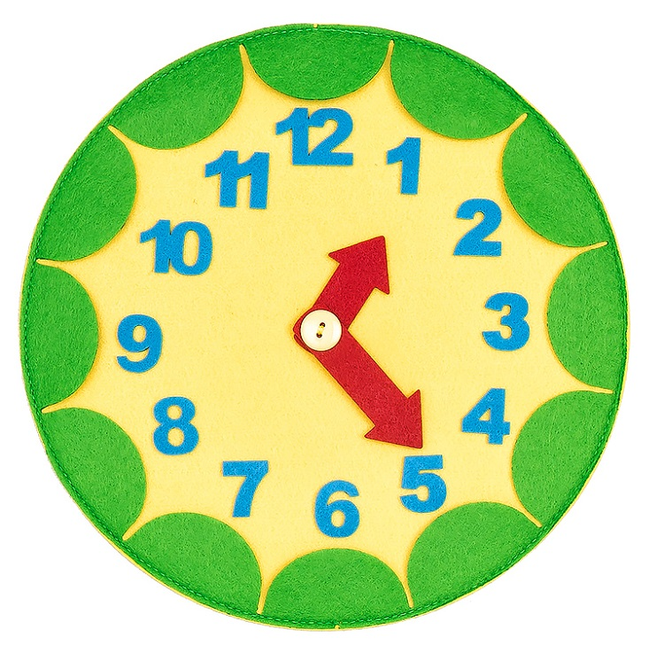
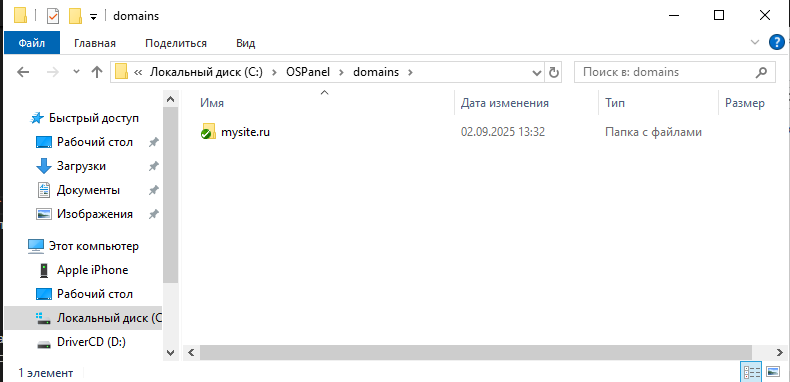
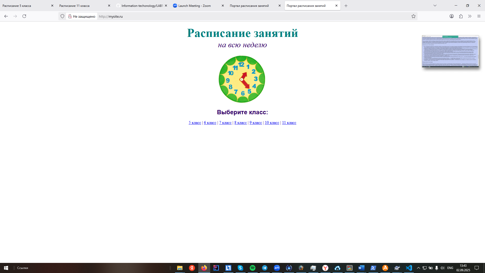

# Лабораторная работа №1: Разработка веб-портала расписания на HTML

## 📋 Цель работы
Создание веб-страниц с использованием HTML для отображения расписания занятий, изучение базовых HTML-тегов и принципов форматирования текста, добавления изображений, таблиц и гиперссылок.

## 🎯 Задачи работы
- Научиться создавать и редактировать HTML-документы
- Овладеть навыками применения тегов для форматирования текста и добавления элементов (таблицы, изображения)
- Разработать несколько HTML-страниц с расписанием занятий и гиперссылками между ними

## 📁 Структура проекта
```
mysite.ru/
│
├── index.html          # Главная страница
├── 5.html             # Расписание для 5 класса
├── 6.html             # Расписание для 6 класса
├── 7.html             # Расписание для 7 класса
├── 8.html             # Расписание для 8 класса
├── 9.html             # Расписание для 9 класса
├── 10.html            # Расписание для 10 класса
├── 11.html            # Расписание для 11 класса
├── CLOCKS.jpg         # Изображение часов
└── README.md          # Документация
```

## 💻 Использованные технологии
- HTML5
- Встроенные стили (атрибуты style, font, align)
- Табличная верстка
- Гиперссылки
- Изображения

## 🏗️ Основные HTML-теги

### Структурные теги
```html
<!DOCTYPE html>
<html>
<head>
<body>
```

### Теги форматирования текста
```html
<font> - для изменения размера, цвета и стиля текста
<b> - жирный текст
<i> - курсив
<u> - подчеркивание
<p> - абзац
<br> - перевод строки
```

### Элементы содержимого
```html
<table> - таблицы
<tr> - строки таблицы
<td> - ячейки таблицы
 - изображения
<a> - гиперссылки
```

## 📝 Пример кода главной страницы

```html
<!DOCTYPE html>
<html lang="ru">
<head>
    <meta charset="UTF-8">
    <meta name="viewport" content="width=device-width, initial-scale=1.0">
    <title>Портал расписания занятий</title>
</head>
<body>
    <p align="center">
        <font color="#008080" size="7">
            <b>Расписание занятий</b>
        </font>
        <br>
        <font size="6"><i>на всю неделю</i></font>
        <br><br>
        
    </p>

    <p align="center">
        <font size="5" face="Arial">
            <b>Выберите класс:</b>
        </font>
        <br><br>
        <a href="5.html">5 класс</a> |
        <a href="6.html">6 класс</a> |
        <a href="7.html">7 класс</a> |
        <a href="8.html">8 класс</a> |
        <a href="9.html">9 класс</a> |
        <a href="10.html">10 класс</a> |
        <a href="11.html">11 класс</a>
    </p>
</body>
</html>
```

## 📊 Пример таблицы расписания

```html
<table border="1" width="100%" bgcolor="#99CCCC">
    <tr bgcolor="#CCCCFF" align="center">
        <td>Урок</td>
        <td>5 "А"</td>
        <td>5 "Б"</td>
        <td>5 "В"</td>
    </tr>
    <tr align="center">
        <td>1</td>
        <td>Русский язык</td>
        <td>Литература</td>
        <td>История</td>
    </tr>
    <tr align="center">
        <td>2</td>
        <td>Математика</td>
        <td>Информатика</td>
        <td>Английский язык</td>
    </tr>
</table>
```

## 🚀 Инструкция по запуску

1. Скопируйте все файлы в одну папку
2. Откройте файл `index.html` в браузере
3. Для тестирования на OpenServer:
   - Установите OpenServer
   - Поместите файлы в папку `domains/mysite.ru/`
   
   - Добавьте запись `127.0.0.1 mysite.ru` в файл hosts
   - Запустите через панель OpenServer

## ✅ Результаты работы

- Создана главная страница с навигацией по классам
- Разработаны отдельные страницы для каждого класса (5-11)
- Реализовано табличное представление расписания на всю неделю
- Добавлены изображения и оформление текста
- Обеспечена навигация между страницами через гиперссылки

## 📝 Вывод

В ходе лабораторной работы были освоены базовые принципы HTML-верстки, создан функциональный веб-портал с расписанием занятий, приобретены практические навыки работы с HTML-тегами, таблицами, изображениями и гиперссылками.