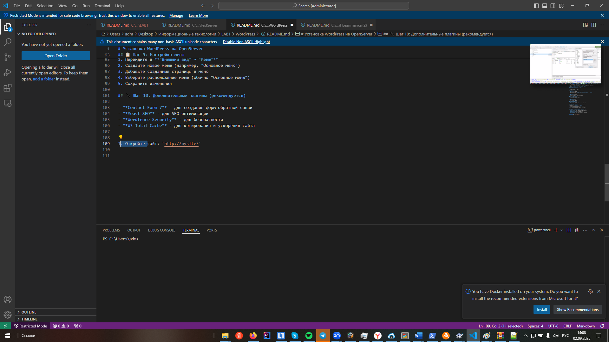

# Установка WordPress на OpenServer

## 📥 Шаг 1: Скачивание WordPress

1. Перейдите на официальный сайт: [https://wordpress.org/download/](https://wordpress.org/download/)
2. Нажмите кнопку **"Download WordPress"**
3. Сохраните архив в удобную папку

## ⚙️ Шаг 2: Подготовка OpenServer

1. Запустите OpenServer (флажок должен стать зеленым)
2. Нажмите правой кнопкой на флажок OpenServer
3. Выберите **"Дополнительно" → "PhpMyAdmin"**
4. Авторизуйтесь (логин: `root`, пароль: `root`)

## 🗃️ Шаг 3: Создание базы данных

1. В PhpMyAdmin нажмите **"Базы данных"**
2. Введите имя базы данных: `mysite`
3. Нажмите **"Создать"**

## 👤 Шаг 4: Создание пользователя базы данных

1. Перейдите в раздел **"Учетные записи пользователей"**
2. Нажмите **"Добавить учетную запись пользователя"**
3. Заполните данные:
   - **Имя пользователя:** `usermysite`
   - **Имя хоста:** `localhost`
   - **Пароль:** `12345`
   - **Подтверждение пароля:** `12345`
4. Нажмите **"Вперед"**
5. Предоставьте все привилегии для базы данных `mysite`
6. Нажмите **"Вперед"** и завершите создание

## 📂 Шаг 5: Установка WordPress

1. Распакуйте скачанный архив WordPress в папку: `OpenServer/domains/mysite/`
2. Переименуйте файл `wp-config-sample.php` в `wp-config.php`
3. Откройте `wp-config.php` в текстовом редакторе
4. Найдите и измените настройки базы данных:

```php
define('DB_NAME', 'mysite');
define('DB_USER', 'usermysite');
define('DB_PASSWORD', '12345');
define('DB_HOST', 'localhost');
```

## 🚀 Шаг 6: Завершение установки

1. В браузере перейдите по адресу: `http://mysite/`
2. Следуйте инструкциям установщика WordPress
3. Заполните информацию о сайте:
   - Название сайта
   - Логин администратора
   - Пароль
   - Email

## 🎨 Шаг 7: Установка темы

1. После установки войдите в админ-панель: `http://mysite/wp-admin/`
2. В меню слева выберите **"Внешний вид" → "Темы"**
3. Нажмите **"Добавить новую"**
4. Выберите понравившуюся тему (например: Astra, OceanWP, Twenty Twenty-Four)
5. Нажмите **"Установить"** и затем **"Активировать"**

## 📄 Шаг 8: Создание страниц для сайта

1. В админ-панели выберите **"Страницы" → "Добавить новую"**
2. Создайте основные страницы:

### 🏠 Главная страница
- **Заголовок:** "Главная"
- Добавьте контент: приветствие, описание сайта
- Установите как главную: **"Настройки" → "Чтение" → "Главная страница"**

### 👥 Страница "О нас"
- **Заголовок:** "О нас"
- Контент: информация о сайте, миссия, цели

### 🛠️ Страница "Услуги"
- **Заголовок:** "Услуги"
- Перечислите предлагаемые услуги

### 📝 Страница "Блог"
- **Заголовок:** "Блог"
- Для отображения записей

### 📞 Страница "Контакты"
- **Заголовок:** "Контакты"
- Добавьте контактную информацию, форму обратной связи

## 📋 Шаг 9: Настройка меню

1. Перейдите в **"Внешний вид" → "Меню"**
2. Создайте новое меню (например, "Основное меню")
3. Добавьте созданные страницы в меню
4. Выберите расположение меню (обычно "Основное меню")
5. Сохраните изменения

## 🔌 Шаг 10: Дополнительные плагины (рекомендуется)

- **Contact Form 7** - для создания форм обратной связи
- **Yoast SEO** - для SEO оптимизации
- **Wordfence Security** - для безопасности
- **W3 Total Cache** - для кэширования и ускорения сайта

 
Сайт: `http://mysite/`
 

