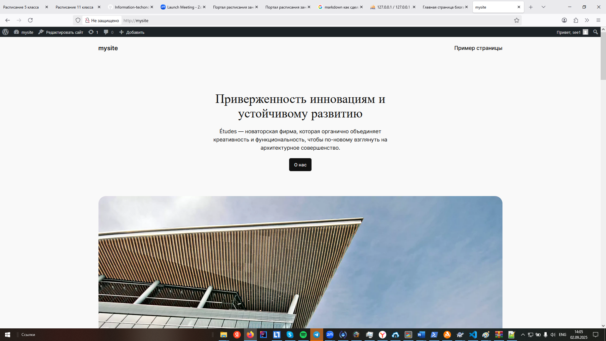

**ОТЧЕТ ПО ЛАБОРАТОРНОЙ РАБОТЕ**  
**Установка и настройка WordPress на OpenServer**

---

### **Цель работы**  
Освоение процесса установки системы управления контентом WordPress на локальный сервер OpenServer, создание базы данных, настройка сайта и изучение базовых принципов работы с CMS.

---

### **Задачи работы**  
1. Изучить процедуру скачивания и распаковки WordPress.  
2. Освоить создание базы данных и пользователя в PhpMyAdmin.  
3. Научиться настраивать файл конфигурации WordPress.  
4. Овладеть навыками установки тем и создания страниц.  
5. Изучить основы настройки меню и установки плагинов.  

---

### **Оборудование и программное обеспечение**  
- Компьютер с ОС Windows;  
- OpenServer;  
- WordPress 6.4+;  
- Браузер для тестирования.  

---

### **Теоретические сведения**  
WordPress — свободно распространяемая система управления контентом с открытым исходным кодом. Написана на PHP и использует MySQL в качестве базы данных.  
OpenServer — portable server platform и программа для создания и хостинга сайтов на локальном компьютере.  

---

### **Ход работы**  

#### **Шаг 1: Скачивание WordPress**  
1. Перешел на официальный сайт [https://wordpress.org/download/](https://wordpress.org/download/).  
2. Скачал последнюю версию WordPress в виде zip-архива.  
3. Сохранил архив в рабочую директорию.  

#### **Шаг 2: Подготовка OpenServer**  
1. Запустил OpenServer.  
2. Дождался, когда индикатор в трее стал зеленым.  
3. Через контекстное меню OpenServer выбрал:  
   **"Дополнительно" → "PhpMyAdmin"**.  
4. Выполнил авторизацию с учетными данными по умолчанию:  
   - **Логин:** `root`;  
   - **Пароль:** `root`.  

#### **Шаг 3: Создание базы данных**  
1. В интерфейсе PhpMyAdmin нажал вкладку **"Базы данных"**.  
2. В поле **"Создать базу данных"** ввел имя: **`mysite`**.  
3. Нажал кнопку **"Создать"**.  

#### **Шаг 4: Создание пользователя базы данных**  
1. Перешел в раздел **"Учетные записи пользователей"**.  
2. Нажал **"Добавить учетную запись пользователя"**.  
3. Заполнил данные:  
   - **Имя пользователя:** `usermysite`;  
   - **Имя хоста:** `localhost`;  
   - **Пароль:** `12345`;  
   - **Подтверждение пароля:** `12345`.  
4. Нажал **"Вперед"**.  
5. Предоставил все привилегии для базы данных `mysite`.  
6. Завершил создание пользователя.  

#### **Шаг 5: Установка WordPress**  
1. Распаковал скачанный архив WordPress в папку:  
   `OpenServer/domains/mysite/`.  
2. Переименовал файл `wp-config-sample.php` в `wp-config.php`.  
3. Открыл `wp-config.php` в текстовом редакторе.  
4. Нашел и изменил настройки базы данных:  
   ```php
   define('DB_NAME', 'mysite');
   define('DB_USER', 'usermysite');
   define('DB_PASSWORD', '12345');
   define('DB_HOST', 'localhost');
   ```  

#### **Шаг 6: Завершение установки**  
1. В браузере перешел по адресу: `http://mysite/`.  
2. Следовал инструкциям установщика WordPress.  
3. Заполнил информацию о сайте:  
   - Название сайта;  
   - Логин администратора;  
   - Пароль;  
   - Email.  

#### **Шаг 7: Установка темы**  
1. Вошел в админ-панель: `http://mysite/wp-admin/`.  
2. В меню слева выбрал: **"Внешний вид" → "Темы"**.  
3. Нажал **"Добавить новую"**.  
4. Выбрал тему (например: **Astra**, **OceanWP**, **Twenty Twenty-Four**).  
5. Нажал **"Установить"** и затем **"Активировать"**.  
---

### **Результаты работы**  
- Установлен и настроен WordPress на OpenServer;  
- Создана база данных `mysite` и пользователь `usermysite`;  
- Установлена и активирована тема оформления;  
- Созданы основные страницы сайта;  
- Настроено главное меню;  
- Установлены необходимые плагины.  

---

### **Выводы**  
В ходе лабораторной работы были освоены основные этапы установки и настройки WordPress на локальном сервере OpenServer. Приобретены практические навыки работы с базами данных через PhpMyAdmin, настройки конфигурационных файлов, установки тем и плагинов. Полученные знания позволяют самостоятельно развертывать и настраивать WordPress-сайты для различных целей.

