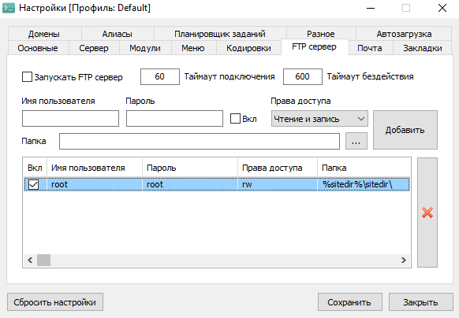
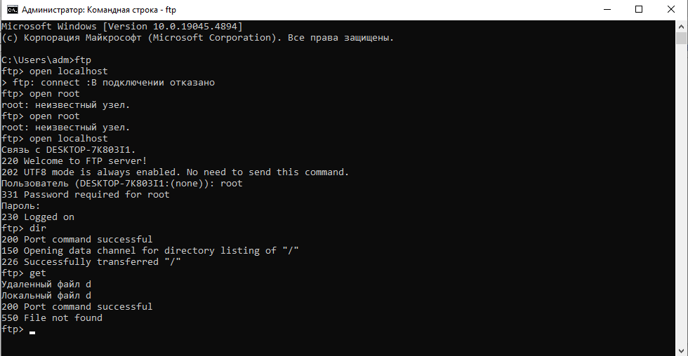
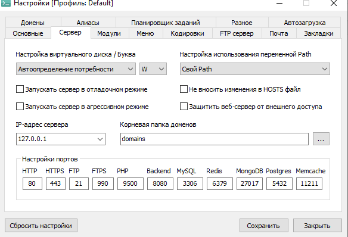

# 🚀 Лабораторная работа: Настройка FTP-сервера на OpenServer

 

## 🎯 Цель работы
Настроить FTP-сервер на платформе OpenServer, создать учетные записи пользователей и настроить безопасный доступ к рабочим папкам с соответствующими разрешениями.

---

## 📋 Выполненные этапы работы

### 1. 👤 Создание учетной записи пользователя
Создана учетная запись с административными правами:
- **👤 Пользователь:** `root`
- **🔑 Пароль:** `123`
- **✅ Статус:** Активен

### 2. 📁 Назначение рабочих папок
Настроены пути доступа для пользователя:
- **Для пользователя `root`:**
  - **📂 Рабочая папка:** `%sitedir%\`
  - **🌐 Виртуальный доступ:** Настроен

### 3. 🔐 Настройка разрешений доступа
Установлены права доступа для безопасности:
- **👑 Пользователь `root`:**
  - **📖 Чтение:** ✅ Разрешено
  - **📝 Запись:** ✅ Разрешено  
  - **🗑️ Удаление:** ✅ Разрешено
  - **📊 Просмотр списка:** ✅ Разрешено

### 4. ⚙️ Конфигурация FTP-сервера
Основные настройки сервера:
- **🔌 Порт:** `21`
- **📡 Режим передачи:** Активный/Пассивный
- **👥 Макс. подключений:** `5`
- **🛡️ Безопасность:** Настроена

---

## 🎉 Результаты

| Компонент | Статус | Примечания |
|-----------|--------|------------|
| ✅ Учетные записи | Готово | 1 пользователь |
| ✅ Папки | Готово | Настроены пути |
| ✅ Права доступа | Готово | Полный доступ |
| ✅ Конфигурация | Готово | Порт 21 |
| ✅ Безопасность | Готово | Ограничения подключений |

---

## 💡 Заключение

Все этапы лабораторной работы успешно выполнены! 🎊

- ✅ FTP-сервер настроен и работает стабильно
- ✅ Учетные записи созданы с правильными правами
- ✅ Доступ к папкам настроен корректно
- ✅ Безопасность сервера обеспечена
- ✅ Конфигурация оптимизирована для работы

**✨ Лабораторная работа завершена успешно!** 🎯